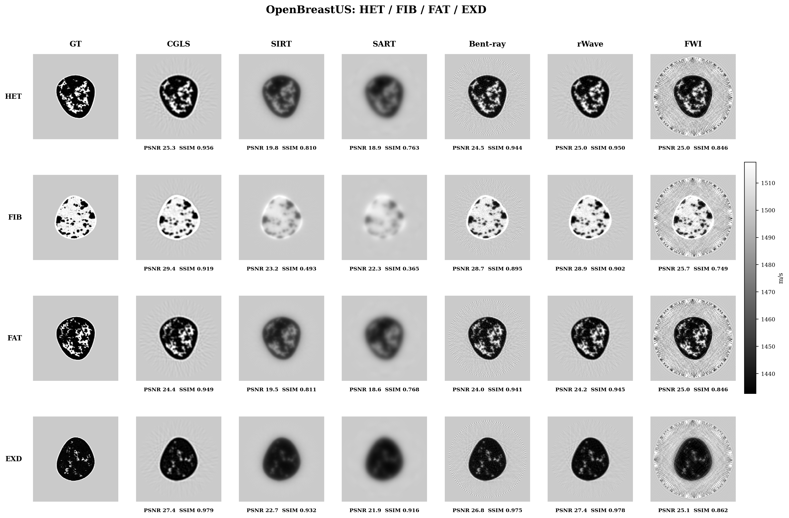
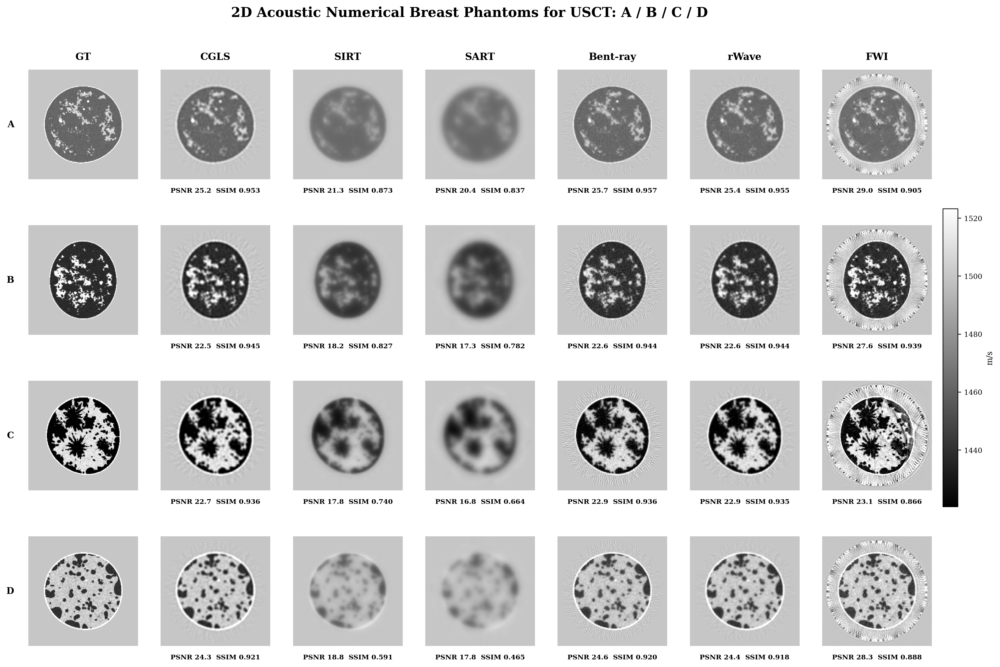

# usct-benchlab

`usct-benchlab` is a v0.1 benchmark harness for ultrasound computed
tomography (USCT) reconstruction. It standardizes data conversion,
`USCTCase -> ReconstructionResult` algorithm execution, image/data metrics,
and benchmark reports for classical USCT baselines and k-Wave FWI.

## v0.1 Status

v0.1 is in cleanup and release preparation. The mainline is intentionally
traditional-first and does not include diffusion, score-based reconstruction,
GANs, or other generative models.

Main conclusion:

- Travel-time surrogate baselines are classical sanity and regression methods.
- k-Wave full-wave data is reserved for the FWI workflow.
- k-Wave-derived ToF/ray/rWave experiments exposed an observable mismatch and
  are retired from benchmark ranking. They remain archived as diagnostics.
- FWI is the current high-fidelity reconstruction mainline.

## Algorithm Tiers

| Tier | Algorithms | Data source | v0.1 role |
| --- | --- | --- | --- |
| Travel-time surrogate baseline | `straight_cgls`, `straight_sirt`, `straight_sart` | Property-map generated travel-time features | Classical solver sanity, fast comparisons |
| Travel-time surrogate baseline | `bent_ray_gn` | Property-map generated travel-time features | Regularized bent-ray surrogate baseline |
| Travel-time surrogate baseline | `rwave_adapter` | Property-map generated travel-time features | rWave/ray-Born surrogate baseline |
| k-Wave FWI mainline | `fwi_kwave_adapter` | Raw or precomputed k-Wave channel data | High-fidelity reconstruction track |
| Diagnostic only | k-Wave-derived ray/rWave/true-bent prototypes | k-Wave-derived apparent ToF or complex feature cases | Archived observable-mismatch diagnostics, not ranked |

## Installation

```bash
pip install -e ".[dev]"
usct --help
usct list-algorithms
pytest -q
```

## Workspace Layout

Use a split workspace so data and generated runs stay out of Git:

```text
<workspace>/
  code/          # this Git repository
  data/          # OpenBreastUS, NBPslice2D, converted cases
  runs/          # benchmark outputs
  external/      # optional third-party checkouts
  checkpoints/   # local model/checkpoint files, never committed
```

Typical environment:

```bash
export USCT_WORKSPACE=/path/to/usct-benchlab
export USCT_DATA_ROOT=$USCT_WORKSPACE/data/openbreastus
export USCT_SAMPLE_ROOT=$USCT_WORKSPACE/data/openbreastus_sample
export USCT_RUN_ROOT=$USCT_WORKSPACE/runs/usctbench_runs
```

## Data Preparation

OpenBreastUS:

```bash
usct data inspect-openbreastus \
  --root "$USCT_DATA_ROOT" \
  --out "$USCT_RUN_ROOT/openbreastus_index.json"

usct data make-quality \
  --root "$USCT_DATA_ROOT" \
  --out "$USCT_WORKSPACE/data/openbreastus_quality" \
  --converted-shape 256 \
  --n-transducers 128
```

NBPslice2D:

```bash
export USCT_NBP_ZIP_PATH=/path/to/NBPslices2D.zip
export USCT_NBP_SAMPLE_ROOT=$USCT_WORKSPACE/data/nbpslice2d_quality

usct data inspect-nbpslice2d \
  --zip "$USCT_NBP_ZIP_PATH" \
  --out "$USCT_RUN_ROOT/nbpslice2d_index.json"

usct data make-nbp-quality \
  --zip "$USCT_NBP_ZIP_PATH" \
  --out "$USCT_NBP_SAMPLE_ROOT" \
  --converted-shape 256 \
  --n-transducers 128
```

## Run Travel-Time Surrogate Benchmark

This is the canonical traditional-method track for CGLS/SIRT/SART, the
bent-ray surrogate, and the rWave surrogate.

```bash
export USCT_TRAVEL_TIME_SURROGATE_CASE_GLOB="$USCT_WORKSPACE/data/openbreastus_quality/cases/*.h5"
export USCT_TRAVEL_TIME_SURROGATE_RUN_ROOT="$USCT_RUN_ROOT"

usct bench --suite configs/benchmarks/travel_time_surrogate_main.yaml
```

The same suite can be pointed at NBPslice2D quality cases by changing
`USCT_TRAVEL_TIME_SURROGATE_CASE_GLOB`.

## Run k-Wave/FWI Benchmark

The FWI track consumes raw/precomputed k-Wave data or an external k-Wave FWI
result through the adapter. It does not run ray/rWave algorithms on k-Wave ToF
features.

```bash
export USCT_KWAVE_FWI_CASE_GLOB="$USCT_WORKSPACE/data/kwave_fwi_main/cases/*.h5"
export USCT_KWAVE_FWI_RUN_ROOT="$USCT_RUN_ROOT"
export USCT_KWAVE_FWI_RESULT_PATH=/path/to/fwi_result.mat

usct bench --suite configs/benchmarks/kwave_fwi_main.yaml
```

For the A100 full-pipeline smoke path:

```bash
bash scripts/run_fwi_kwave_full_pipeline_smoke.sh
```

## Output Artifacts

Each successful algorithm/case run writes:

```text
runs/<run_id>/<case_id>/<algorithm>/result.h5
runs/<run_id>/<case_id>/<algorithm>/metrics.json
runs/<run_id>/<case_id>/<algorithm>/metadata.yaml
runs/<run_id>/<case_id>/<algorithm>/preview.png
```

Benchmark-level outputs include `benchmark_summary.csv`,
`benchmark_report.md`, `benchmark_run_checks.json`, and optional comparison
panels under `comparison_artifacts/`.

## Example Figures

OpenBreastUS four-class comparison:



NBPslice2D, 2D Acoustic Numerical Breast Phantoms for USCT:



In these README panels, CGLS/SIRT/SART, bent-ray, and rWave use travel-time
surrogate measurements. FWI uses k-Wave full-wave data.

## Known Limitations

- Travel-time surrogate benchmarks are useful for solver sanity and regression
  testing, but they are generated from ground-truth property maps and carry
  high inverse-crime risk.
- NBPslice2D 2025 is property-map-only in this repository. Without built-in
  wavefields, its traditional comparisons are surrogate benchmarks.
- OpenBreastUS precomputed wavefield support should be preferred when official
  channel data is available, but the release does not claim every OpenBreastUS
  mirror contains such fields.
- The rWave adapter is a v0.1 surrogate unless a future track validates an
  official complex-wavefield reproduction.
- The true-bent and k-Wave-derived ray/rWave prototypes are diagnostic-only and
  not part of release ranking.
- FWI depends on an external k-Wave/MATLAB/CUDA environment for full-pipeline
  execution. Local tests cover ingestion, command construction, and artifact
  handling.

## Diagnostic-Only Paths

Archived development suites live under `configs/benchmarks/archive/`, and
experimental algorithm configs live under `configs/algorithms/experimental/`.
They are retained to document observable-mismatch work, external MATLAB adapter
experiments, and k-Wave unified feature diagnostics. They should not be mixed
into the v0.1 main benchmark tables.

## License and Citations

This repository is released under the license declared in `pyproject.toml`.
Dataset and external-code users must follow the licenses and citation
requirements of OpenBreastUS, NBPslice2D, k-Wave, WaveformInversionUST, and any
optional MATLAB toolboxes they install outside this repository. See
`docs/EXTERNAL_SOURCES_AND_LICENSES.md` and `docs/references.bib`.
