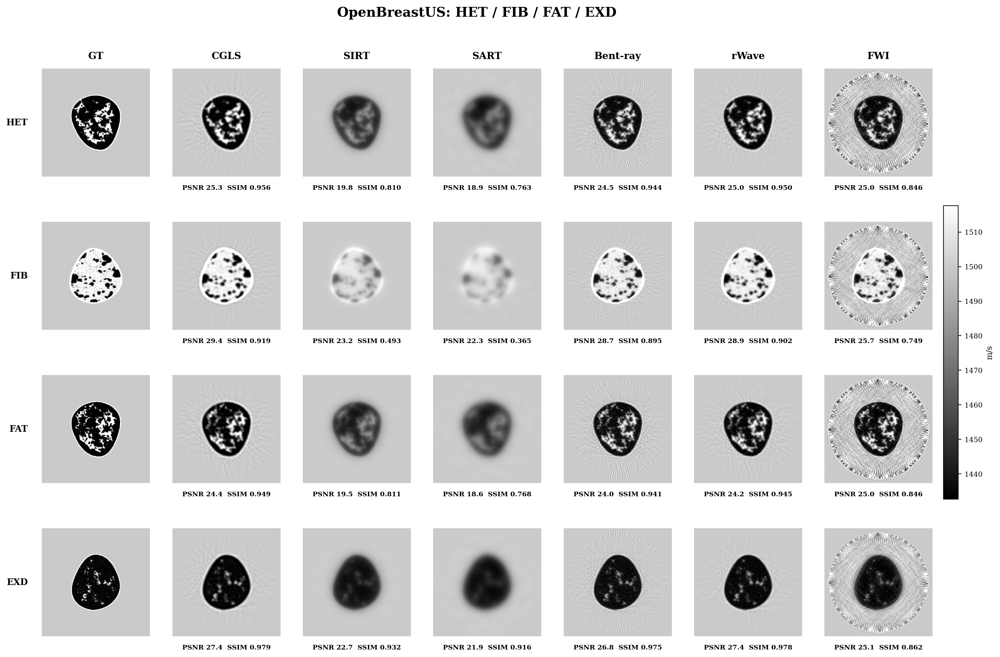
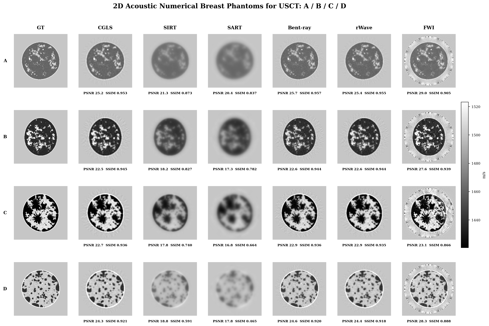

# usct-benchlab

[中文说明](README.zh-CN.md)

`usct-benchlab` focuses on research-grade numerical benchmarking and runtime
integration for **2-D ultrasound sound-speed reconstruction**. It provides unified
case/result interfaces, dataset preparation, classical and native physical-model
solvers, FWI adapters, metrics, and reproducible benchmark reports. It does not
provide an attenuation-reconstruction API or claim clinical validity.

## What is USCT?

**Ultrasound computed tomography is a PDE-constrained inverse problem.** A
source transducer emits an acoustic pulse, the pressure field propagates through
the object according to an acoustic wave equation, and receiver transducers
measure the resulting pressure traces. The inverse problem is to recover
spatial acoustic properties from those measurements.

The reconstructed quantity is the sound-speed map $c(x)$. Datasets use the
common `USCTCase` schema and algorithm outputs use `ReconstructionResult`.

## Mathematical Formulation

USCT should be read as a PDE-driven inverse problem, not as a generic image
reconstruction task. A source transducer excites an acoustic pressure field,
the field propagates through the unknown medium, and receiver measurements are
used to infer the medium parameters.

$$
\frac{1}{c(x)^2}\partial_{tt}p_s(t,x)-\Delta p_s(t,x)=q_s(t,x).
$$

In frequency-domain notation, the corresponding Helmholtz form is commonly
written as

$$
\left(\Delta+\omega^2m(x)\right)\hat p_s(\omega,x)=-\hat q_s(\omega,x).
$$

Here $p_s$ is pressure for source $s$, $q_s$ is the emitted source, $c(x)$ is
sound speed, and $m(x)$ is squared slowness:

$$
m(x)=\frac{1}{c(x)^2}.
$$

Most sound-speed methods in this repository estimate either the sound-speed map
$c(x)$ or a slowness map

$$
u(x)=\frac{1}{c(x)}.
$$

Receiver $r$ observes the propagated field through a measurement operator:

$$
d_{sr}(t)=\mathcal M_r p_s(t,\cdot)+\eta_{sr}(t).
$$

The key distinction between algorithms is how much of this wave physics they
keep. Waveform-based FWI keeps the acoustic PDE or Helmholtz solve inside the
optimization and matches measured pressure traces or complex frequency-domain
pressure. Travel-time surrogate methods first reduce the data to arrival-time
features, then invert a ray or eikonal approximation. They are faster and more
stable as baselines, but they discard waveform phase, amplitude, diffraction,
and much of the finite-frequency physics.

The straight-ray travel-time approximation uses a reference speed $c_0$ and
fixed path $\gamma_{sr}$:

$$
\Delta t_{sr}\approx\int_{\gamma_{sr}}\delta u(x)d\ell.
$$

The slowness perturbation is

$$
\delta u(x)=\frac{1}{c(x)}-\frac{1}{c_0}.
$$

After pixel discretization, the straight-ray model becomes

$$
A\delta u\approx b.
$$

CGLS, SIRT, and SART are different solvers or update rules for this algebraic
travel-time system. A representative regularized objective is

$$
\min_{\delta u}\|W(A\delta u-b)\|_2^2+\lambda^2\|L\delta u\|_2^2.
$$

This is the quadratic CGLS objective, with $W_{ii}=\sqrt{w_i}$. The current
SIRT row normalization instead induces weights $w_i/\sum_jA_{ij}$; subset SART
can cycle on inconsistent data. Their shared forward model does not imply an
identical objective or a monotonic global loss, especially with optional smoothing.
See [the numerical solver audit](docs/validation/2026-09-09_inverse_solver_audit_CN.md).

Bent-ray methods keep a high-frequency travel-time model in which paths depend
on the current medium:

$$
|\nabla T_s(x)|=u(x).
$$

The receiver travel time is approximated by

$$
t_{sr}\approx T_s(r).
$$

The idealized nonlinear travel-time objective is

$$
\min_c\sum_{s,r}\left|t_{sr}^{\mathrm{obs}}-T_s(r;c)\right|^2+\lambda R(c).
$$

FWI uses the pressure data directly. In frequency-domain form, a common
PDE-constrained objective is

$$
\min_c\frac{1}{2}\sum_{\omega,s,r}\left|\hat p_s(\omega,r;c)-\hat p_{sr}^{\mathrm{obs}}(\omega)\right|^2+\lambda R(c).
$$

In this expression, $\hat p_s(\omega,r;c)$ is not an arbitrary image operator;
it is the pressure predicted by an acoustic PDE or Helmholtz solver for the
candidate sound speed.

| Method | Modeling assumption | Optimization target | Appropriate use |
| --- | --- | --- | --- |
| CGLS | Fixed straight rays through a reference medium; travel-time delays are linearized in slowness perturbation. | Krylov solve of the weighted regularized least-squares system for $A\delta u\approx b$. | Fast, reproducible sound-speed baseline and regression test for ring-geometry cases. |
| SIRT | Same straight-ray algebraic model as CGLS, but with simultaneous normalized residual backprojection updates. | Iteratively reduce the weighted residual of $A\delta u\approx b$ with relaxation and smoothing. | Robust baseline when stability matters more than sharp convergence. |
| SART | Same straight-ray model, updated by ordered transmitter or ray subsets. | Ordered row-action updates that reduce the algebraic travel-time residual subset by subset. | Faster early iterations and sharper straight-ray baselines, with more sensitivity to ordering and relaxation. |
| Bent-ray | High-frequency travel time follows an eikonal model; rays bend according to the current sound speed or slowness. | Regularized nonlinear travel-time mismatch based on $T_s(r;c)$. | Refraction-aware surrogate comparison when full waveform inversion is too expensive or unavailable. |
| FWI | Full acoustic wave or Helmholtz propagation; measured data are pressure waveforms or complex pressure samples. | PDE-constrained waveform mismatch over sources, receivers, and frequencies. | High-fidelity reporting when external k-Wave/FWI artifacts or an external FWI command are available. |

`bent_ray_gn` solves a nonlinear Eikonal equation with fast marching and an
exact discrete Jacobian/adjoint. `rwave_adapter` requires calibrated complex
pressure and relinearizes finite-frequency Born scattering. Its supplied config
uses full Green backgrounds from a free-space volume-integral solve; the
Eikonal/WKB Green approximation remains an explicit option. Neither uses the
straight-ray projector. These discretizations
do not guarantee a monotone ranking of image quality or reproduce every option
of upstream r-Wave. Production FWI calls the pinned WUST MATLAB/CUDA runtime.
For more detail, see [docs/math_formulation.md](docs/math_formulation.md).

## Supported Algorithms

For validated Python/YAML parameters, see the [parameter contract](docs/parameter_contract.md).
Research Agent consumers can discover physical variants and permitted controls with
`usct list-algorithms --json` and `usct describe-algorithm <id> --json`;
see the [Agent API guide](docs/agent_algorithm_api.md).

| Algorithm | Command name | Mathematical model | Input requirement | Typical use | Config |
| --- | --- | --- | --- | --- | --- |
| CGLS | `straight_cgls` | Straight-ray weighted least squares | `USCTCase` with ring geometry and travel-time measurements | Fast sound-speed baseline | `configs/algorithms/cgls.yaml` |
| SIRT | `straight_sirt` | Simultaneous iterative ray tomography | `USCTCase` with ring geometry and travel-time measurements | Robust iterative sound-speed baseline | `configs/algorithms/sirt.yaml` |
| SART | `straight_sart` | Ordered/subset algebraic ray update | `USCTCase` with ring geometry and travel-time measurements | Ordered-update straight-ray baseline | `configs/algorithms/sart.yaml` |
| Bent-ray | `bent_ray_gn` | Nonlinear Eikonal / fast marching | First-arrival times or calibrated delays | Refraction-corrected tomography | `configs/algorithms/bent_ray.yaml` |
| rWave adapter | `rwave_adapter` | Relinearized finite-frequency Ray-Born | Complex `(frequency,tx,rx)` pressure and calibrated source or independent water reference | Scattering-sensitive pressure inversion | `configs/algorithms/rwave.yaml` |
| WUST FWI | `fwi_wust` | PDE-level frequency-domain inversion | Total complex pressure, declared convention and mask | CUDA full-wave reconstruction | `configs/algorithms/fwi_wust.yaml` |

More details are in [docs/algorithms.md](docs/algorithms.md).

### Physics and Agent Validation

Canonical operators live in `usctbench.operators.<physical_operator>`; forward/adjoint compatibility imports remain thin. Production full-wave numerics belong to WUST. See [operator contracts](docs/operator_contract.md).

Native solvers support grouped receiver/frequency validation and OR stopping:
residual/noise targets, update/objective/validation stagnation, time/call budgets
and iteration caps. Reports retain the actual stop reason, selected checkpoint
and work counts. GT metrics are optional and never select iterates by default.
See [evaluation and stopping](docs/agent_evaluation.md) and the
[reproducible validation workflow](docs/physics_validation.md).

## Installation

Conda workflow:

```bash
conda create -n usctbench python=3.10 -y
conda activate usctbench
pip install -e ".[dev,viz]"
```

Pip workflow:

```bash
pip install -r requirements.txt
pip install -e .
```

Check the installation:

```bash
usct --help
usct list-algorithms
pytest -q
```

For a minimal end-to-end run that writes only to `/tmp`, use:

```bash
bash examples/synthetic_quickstart.sh
```

## Environment and Workspace Layout

Use environment variables so local data and generated runs stay outside Git:

```bash
export USCT_WORKSPACE=/path/to/usct-benchlab
export USCT_DATA_ROOT=$USCT_WORKSPACE/data/openbreastus
export USCT_RUN_ROOT=$USCT_WORKSPACE/runs/usctbench_runs
export USCT_NBP_ZIP_PATH=/path/to/NBPslices2D.zip
```

Recommended workspace layout:

```text
<workspace>/
  code/          # this repository
  data/          # local datasets and converted cases
  runs/          # benchmark outputs
  external/      # optional external projects
  checkpoints/   # local weights or checkpoints
```

`scripts/setup_workspace.sh` can create this layout and repo-local symlinks; it
does not copy datasets into Git.

## Prepare Datasets

Synthetic demo:

```bash
usct data make-synthetic-smoke \
  --out "$USCT_WORKSPACE/data/synthetic_demo" \
  --shape 48 \
  --n-transducers 48
```

OpenBreastUS:

```bash
usct data inspect-openbreastus \
  --root "$USCT_DATA_ROOT" \
  --out "$USCT_RUN_ROOT/openbreastus_index.json"

usct data make-quality \
  --root "$USCT_DATA_ROOT" \
  --out "$USCT_WORKSPACE/data/openbreastus_demo" \
  --cases-per-density 1 \
  --converted-shape 256 \
  --n-transducers 128
```

NBPslice2D:

```bash
usct data inspect-nbpslice2d \
  --zip "$USCT_NBP_ZIP_PATH" \
  --out "$USCT_RUN_ROOT/nbpslice2d_index.json"

usct data make-nbp-quality \
  --zip "$USCT_NBP_ZIP_PATH" \
  --out "$USCT_WORKSPACE/data/nbpslice2d_demo" \
  --cases-per-type 1 \
  --converted-shape 256 \
  --n-transducers 128
```

See [docs/usage.md](docs/usage.md) and [docs/datasets.md](docs/datasets.md)
for more complete workflows.

## Run One Algorithm

CGLS:

```bash
usct run straight_cgls \
  --case "$USCT_WORKSPACE/data/synthetic_demo/cases/synthetic_circular_sos.h5" \
  --config configs/algorithms/cgls.yaml \
  --out runs/single_cgls
```

SIRT:

```bash
usct run straight_sirt \
  --case "$USCT_WORKSPACE/data/synthetic_demo/cases/synthetic_circular_sos.h5" \
  --config configs/algorithms/sirt.yaml \
  --out runs/single_sirt
```

SART:

```bash
usct run straight_sart \
  --case "$USCT_WORKSPACE/data/synthetic_demo/cases/synthetic_circular_sos.h5" \
  --config configs/algorithms/sart.yaml \
  --out runs/single_sart
```

Bent-ray:

```bash
usct run bent_ray_gn \
  --case "$USCT_WORKSPACE/data/synthetic_demo/cases/synthetic_circular_sos.h5" \
  --config configs/algorithms/bent_ray.yaml \
  --out runs/single_bent_ray
```

rWave adapter:

```bash
usct run rwave_adapter \
  --case "$USCT_WORKSPACE/data/physics/example/pressure_case.h5" \
  --config configs/algorithms/rwave.yaml \
  --out runs/single_rwave
```

This case must contain actual complex pressure and source calibration, not a
speed-map-derived ToF case. Create a pressure pair using the validation workflow;
`mode: fixed_background` explicitly selects the linear Born reference instead
of the default nonlinear background updates.

FWI with the pinned WUST CUDA runtime:

```bash
export USCT_WUST_ROOT=/path/to/approved/WaveformInversionUST
usct run fwi_wust \
  --case /path/to/frequency_case.h5 \
  --config configs/algorithms/fwi_wust.yaml \
  --out runs/single_fwi
```

Use an existing total-pressure frequency case, not a travel-time demo. The example config requires explicit sound-speed bounds and PML thickness; its values illustrate syntax, not a calibrated preset. One frequency-schedule entry is one update. Completion is not convergence. See [FWI deployment and input contract](docs/fwi.md).

## Run Benchmarks

Demo suites read these optional case globs:

```bash
export USCT_SYNTHETIC_CASE_GLOB="$USCT_WORKSPACE/data/synthetic_demo/cases/*.h5"
export USCT_NBP_CASE_GLOB="$USCT_WORKSPACE/data/nbpslice2d_demo/cases/*.h5"
export USCT_OPENBREASTUS_CASE_GLOB="$USCT_WORKSPACE/data/openbreastus_demo/cases/*.h5"
```

Run the suites:

```bash
usct bench --suite configs/benchmarks/synthetic_demo.yaml
usct bench --suite configs/benchmarks/nbpslice2d_demo.yaml
usct bench --suite configs/benchmarks/openbreastus_demo.yaml
usct bench --suite configs/benchmarks/fwi_wust_demo.yaml
```

## Output Files

Single-algorithm runs write:

```text
runs/single_cgls/synthetic_circular_sos/result.h5
runs/single_cgls/synthetic_circular_sos/metrics.json
runs/single_cgls/synthetic_circular_sos/metadata.yaml
runs/single_cgls/synthetic_circular_sos/preview.png
```

Benchmark suites write:

```text
runs/usctbench_runs/synthetic_demo_YYYYMMDDTHHMMSSZ/straight_cgls/synthetic_circular_sos/result.h5
runs/usctbench_runs/synthetic_demo_YYYYMMDDTHHMMSSZ/straight_cgls/synthetic_circular_sos/metrics.json
runs/usctbench_runs/synthetic_demo_YYYYMMDDTHHMMSSZ/straight_cgls/synthetic_circular_sos/metadata.yaml
runs/usctbench_runs/synthetic_demo_YYYYMMDDTHHMMSSZ/straight_cgls/synthetic_circular_sos/preview.png
runs/usctbench_runs/synthetic_demo_YYYYMMDDTHHMMSSZ/benchmark_summary.csv
runs/usctbench_runs/synthetic_demo_YYYYMMDDTHHMMSSZ/benchmark_report.md
```

`metrics.json` contains per-case image and data-consistency metrics when ground
truth and forward measurements are available. `metadata.yaml` records the
algorithm, config path, case id, runtime, status, and measurement provenance.

New CLI/benchmark runs use **non-water tissue RMSE, PSNR and SSIM** as the
primary image scores. Full-image scores (`full_image_*`) and water-background
RMSE remain separate. The GT mask is used only after reconstruction, never for
initialization or stopping; without GT, image scores are unavailable and
measurement/holdout residuals remain available. Historical figures retain their
original metric definitions. See [evaluation policy](docs/agent_evaluation.md).

## Example Results

The following figures are historical main-branch examples. Their bent/rWave
columns predate the native physics operators and are not validation of the new
implementations. See [physics validation](docs/physics_validation.md) for current
measurements, grids and acceptance boundaries.

OpenBreastUS four-class comparison:



NBPslice2D, 2D Acoustic Numerical Breast Phantoms for USCT:



Different algorithms use different measurement assumptions; interpret result
panels together with [docs/algorithms.md](docs/algorithms.md) and case
metadata.

## Troubleshooting

- `algorithm not found`: run `usct list-algorithms` and check the command name.
- Missing `.h5` or `.mat` data: confirm the dataset conversion command
  completed and that the relevant environment variable points to an existing
  path.
- FWI runtime missing: set `USCT_WUST_ROOT` to the approved clean WUST checkout
  and verify MATLAB/CUDA availability; see [deployment](docs/fwi.md).
- NaN/Inf output: inspect `failure_report.md`, check the case units, and lower
  the iteration count or relaxation in the algorithm config.
- No cases matched by glob: print the expanded `USCT_*_CASE_GLOB` value and
  verify that converted cases exist under `data/.../cases/`.
- `matplotlib` or `scikit-image` missing: install the visualization extras with
  `pip install -e ".[viz]"`.

## Development

```bash
black src tests scripts
ruff check src tests scripts --fix
python -m compileall src tests
pytest -q
bash scripts/run_smoke.sh
python scripts/audit_release.py
```

See [docs/development.md](docs/development.md) for release checks and
repository hygiene.

## Citations / Datasets

Please cite the datasets and external tools used in your experiments, including
OpenBreastUS, NBPslice2D, k-Wave, and WaveformInversionUST when applicable. See
[docs/references.bib](docs/references.bib).

## License

This repository is released under the MIT License. See [LICENSE](LICENSE).
