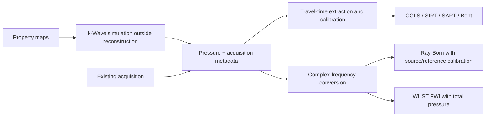
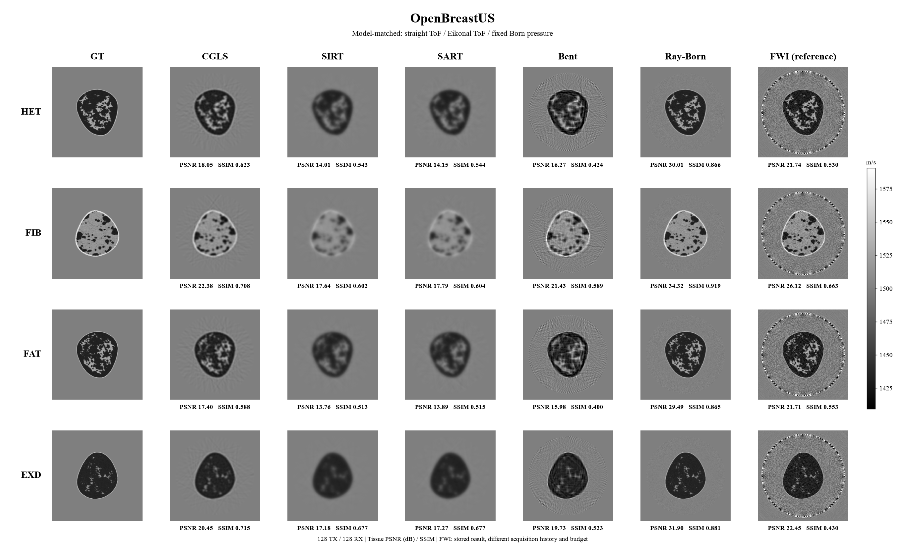
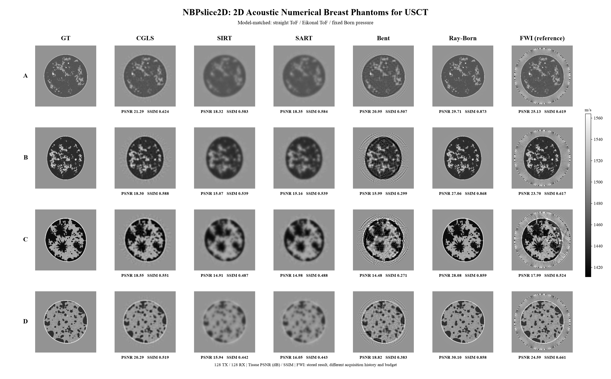
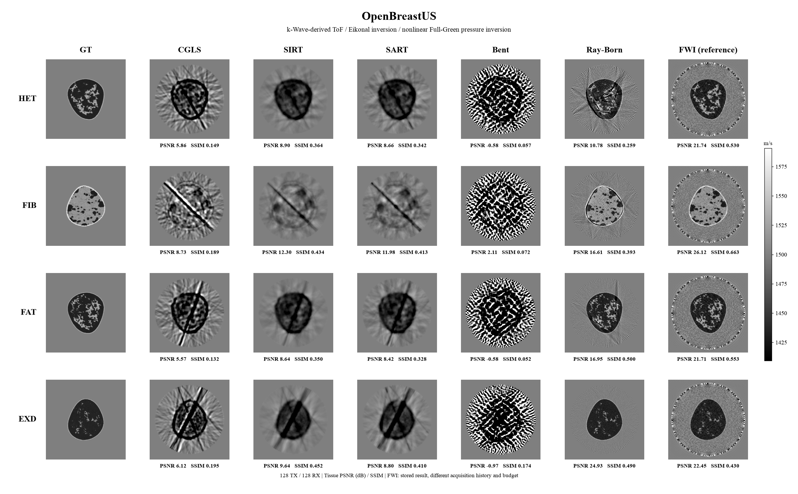
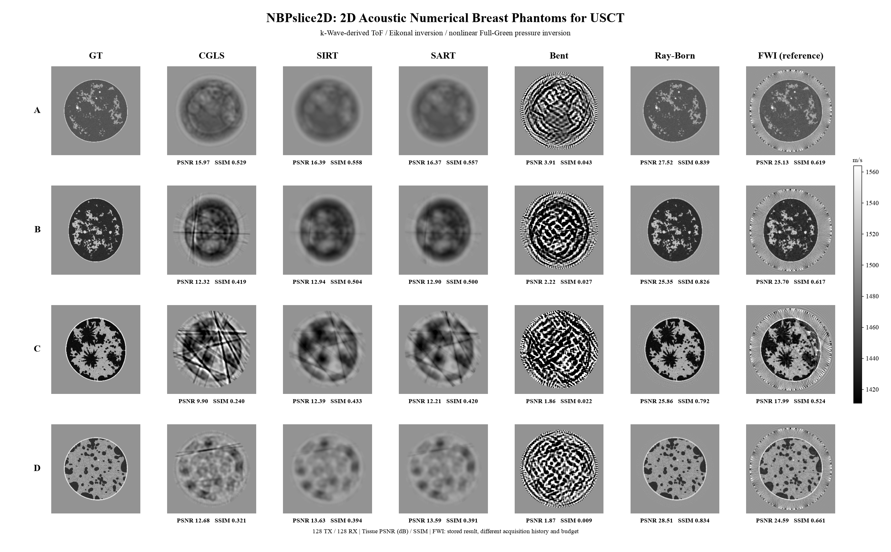

# usct-benchlab

[中文说明](README.zh-CN.md) · [Usage](docs/usage.md) · [Algorithms](docs/algorithms.md) · [Agent API](docs/agent_algorithm_api.md)

A research package for **2-D ultrasound sound-speed reconstruction**, with unified case/result interfaces, native physical operators, numerical solvers, and an external WUST full-wave runtime. Active reconstruction is sound-speed-only. Numerical and phantom validation do not establish clinical validity.

## What Is New on Main

- **Native Bent/Eikonal:** nonlinear fast-marching travel times and a discrete Jacobian/adjoint replace the former straight-ray surrogate.
- **Native Ray-Born:** fixed and relinearized WKB or Full-Green pressure inversion. `rwave_adapter` remains the command id, not a claim of reproducing the upstream r-Wave package.
- **Pressure-preserving k-Wave input:** explicit geometry, axes, Fourier convention, masks and provenance. Travel-time features and complex pressure remain distinct observations.
- **Production FWI is `fwi_wust`:** the maintained WUST fork owns frequency ingestion and MATLAB/CUDA reconstruction. Old FWI pipeline/result-import APIs are removed.
- **Typed parameters and execution contracts:** Agent/expert/deployment permissions, compute budgets, stopping reasons and optional no-GT evaluation.

There are six public algorithms below. Attenuation reconstruction is not exposed. `TinyFWIAlgorithm` remains a directly importable mathematical regression fixture, not a CLI or Agent algorithm.

## What Is USCT?

USCT is a **PDE-constrained inverse problem**: transmitters excite an acoustic field, receivers measure pressure, and reconstruction estimates sound speed $c(x)$. A simplified constant-density, lossless model is

$$
\frac{1}{c(x)^2}\partial_{tt}p_s(t,x)-\Delta p_s(t,x)=q_s(t,x),\qquad d_{sr}(t)=\mathcal M_r p_s(t,\cdot)+\eta_{sr}(t).
$$

| Model | Mathematical relation | Interpretation |
|---|---|---|
| Straight rays | $A\delta s\approx\Delta t$, $\delta s=1/c-1/c_0$ | Fixed paths; CGLS/SIRT/SART use different updates |
| Eikonal | $\lVert\nabla T_s\rVert=1/c$ | Medium-dependent first-arrival travel time |
| Born | $\delta\hat p\approx J_m\delta m$, $m=1/c^2$ | Complex-pressure sensitivity around a background |
| FWI | $\hat p(c)$ from a Helmholtz solve | Nonlinear total-pressure inversion |

A representative straight-ray objective is

$$
\min_{\delta s}\frac12\lVert W(A\delta s-\Delta t)\rVert_2^2+\frac{\lambda^2}{2}\lVert L\delta s\rVert_2^2.
$$

This describes quadratic CGLS, not an identical objective for all row-action solvers: SIRT uses row normalization, and subset SART need not monotonically decrease a global loss. WUST matches total complex pressure while eliminating source scale per transmitter/frequency. See [mathematical formulation](docs/math_formulation.md).

## Supported Algorithms

| Method | Command id | Required observation | Config |
|---|---|---|---|
| CGLS | `straight_cgls` | Travel-time delays, validity/weights | [cgls.yaml](configs/algorithms/cgls.yaml) |
| SIRT | `straight_sirt` | Travel-time delays, validity/weights | [sirt.yaml](configs/algorithms/sirt.yaml) |
| SART | `straight_sart` | Travel-time delays, validity/weights | [sart.yaml](configs/algorithms/sart.yaml) |
| Bent / Eikonal | `bent_ray_gn` | First-arrival times or calibrated delays | [bent_ray.yaml](configs/algorithms/bent_ray.yaml) |
| Ray-Born / Full-Green | `rwave_adapter` | Complex pressure and source calibration or independent water reference | [rwave.yaml](configs/algorithms/rwave.yaml) |
| WUST FWI | `fwi_wust` | Total complex pressure, declared convention and mask | [fwi_wust.yaml](configs/algorithms/fwi_wust.yaml) |

Born variants are `wkb_fixed`, `wkb_nonlinear`, `full_green_fixed`, `full_green_nonlinear`. The supplied YAML selects nonlinear Full-Green; query the chosen variant rather than assuming every entrypoint has the same defaults. WKB sensitivity approximates the derivative of its nonlinear predictor. Eikonal derivatives follow the active stencil, whose changes can be nonsmooth.

Canonical operators live in `usctbench.operators.straight_ray`, `.eikonal`, `.ray_born`. Forward prediction, linearization and adjoint action are separate; **an adjoint is not an inverse**. Legacy `operators.forward.*` / `operators.adjoint.*` are compatibility imports.

## Installation and Quick Start

From this repository's checkout:

```bash
conda create -n usctbench python=3.10 -y
conda activate usctbench
pip install -e ".[dev,viz]"
usct --help
usct list-algorithms --json
bash examples/synthetic_quickstart.sh
```

The quickstart writes under `/tmp/usctbench_examples` without MATLAB/GPU. Alternatively run `pip install -r requirements.txt` and `pip install -e ".[viz]"`. Optional `.[performance]` enables compiled native loops.

## Environment and Data Preparation

```text
workspace/
  code/          # this repo: src/, configs/, tests/, docs/, scripts/
  data/          # maps and converted USCTCase files
  runs/          # reconstructions, logs and reports
  external/      # maintained WUST checkout
  checkpoints/  # local artifacts, not committed
```

```bash
export USCT_WORKSPACE=/path/to/workspace
export USCT_DATA_ROOT="$USCT_WORKSPACE/data/openbreastus"
export USCT_NBP_ZIP_PATH=/path/to/NBPslices2D.zip
export USCT_RUN_ROOT="$USCT_WORKSPACE/runs"
mkdir -p "$USCT_RUN_ROOT"
```

### Simplified ToF Demos

These commands generate property-map-derived straight-ray observations, **not k-Wave pressure**:

```bash
usct data make-synthetic-smoke --out "$USCT_WORKSPACE/data/synthetic_demo" --shape 48 --n-transducers 48

usct data inspect-openbreastus --root "$USCT_DATA_ROOT" --out "$USCT_RUN_ROOT/openbreastus_index.json"
usct data make-quality --root "$USCT_DATA_ROOT" --out "$USCT_WORKSPACE/data/openbreastus_demo" --cases-per-density 1 --converted-shape 256 --n-transducers 128

usct data inspect-nbpslice2d --zip "$USCT_NBP_ZIP_PATH" --out "$USCT_RUN_ROOT/nbpslice2d_index.json"
usct data make-nbp-quality --zip "$USCT_NBP_ZIP_PATH" --out "$USCT_WORKSPACE/data/nbpslice2d_demo" --cases-per-type 1 --converted-shape 256 --n-transducers 128
```

Matched Eikonal/Born validation instead uses each model's own observations. NBPslice2D property maps are not built-in waveforms; distinguish OpenBreastUS maps from precomputed wavefields too. See [datasets](docs/datasets.md).

### k-Wave / Existing Pressure


```mermaid
flowchart LR
    A[Property maps] --> B[k-Wave simulation outside reconstruction]
    B --> C[Pressure + acquisition metadata]
    D[Existing acquisition] --> C
    C --> E[Travel-time extraction and calibration]
    C --> F[Complex-frequency conversion]
    E --> G[CGLS / SIRT / SART / Bent]
    F --> H[Ray-Born with source/reference calibration]
    F --> I[WUST FWI with total pressure]
```

Unified acquisition does not mean identical observations. Each method needs its own feature/calibration path; ToF-only cases cannot run pressure inversion. GT never regenerates production FWI observations.

For the supported WUST-layout MATLAB v7.3 dataset:

```bash
python -m usctbench.data.waveforms /path/to/acquisition.mat /path/to/pressure_case.h5 \
  --frequencies-hz 150000 200000 250000 --reference-sound-speed-mps 1500
```

These frequencies illustrate syntax, not a recommended band. This is not an arbitrary-MAT converter and does not add every algorithm's ToF features. Check water/source calibration for Born. See [importer](src/usctbench/data/waveforms.py) and [physics validation](docs/physics_validation.md).

| Quantity | Contract |
|---|---|
| Image / geometry | `[y,x]`; speed m/s, coordinates m, cell-edge origin |
| Pressure | `time_data[time,tx,rx]`, `freq_data[frequency,tx,rx]` |
| Sampling | Actual time in s, frequency in Hz; explicit Fourier/normalization convention |
| Validity | Explicit mask; valid zero signals are not missing data |

## Run Algorithms and Benchmarks

```bash
usct run straight_cgls \
  --case "$USCT_WORKSPACE/data/synthetic_demo/cases/synthetic_circular_sos.h5" \
  --config configs/algorithms/cgls.yaml --out "$USCT_RUN_ROOT/single_cgls"

usct run bent_ray_gn --case /path/to/tof_case.h5 --config configs/algorithms/bent_ray.yaml --out "$USCT_RUN_ROOT/single_bent"
usct run rwave_adapter --case /path/to/pressure_case.h5 --config configs/algorithms/rwave.yaml --out "$USCT_RUN_ROOT/single_born"
```

For SIRT/SART use `straight_sirt` / `sirt.yaml` or `straight_sart` / `sart.yaml` with the ToF case. [Full usage examples](docs/usage.md).

```bash
export USCT_SYNTHETIC_CASE_GLOB="$USCT_WORKSPACE/data/synthetic_demo/cases/*.h5"
export USCT_OPENBREASTUS_CASE_GLOB="$USCT_WORKSPACE/data/openbreastus_demo/cases/*.h5"
export USCT_NBP_CASE_GLOB="$USCT_WORKSPACE/data/nbpslice2d_demo/cases/*.h5"
usct bench --suite configs/benchmarks/synthetic_demo.yaml
usct bench --suite configs/benchmarks/openbreastus_demo.yaml
usct bench --suite configs/benchmarks/nbpslice2d_demo.yaml

# These prepared pressure cases must also include ToF for the ray methods.
export USCT_PRESSURE_CASE_GLOB='/path/to/pressure_cases/*.h5'
usct bench --suite configs/benchmarks/physics_pressure.yaml
```

The ToF demo suites also run Bent as a cross-model smoke, not matched-Eikonal validation. ToF and pressure residuals retain separate domains; do not rank them by raw residual magnitude.

## WUST FWI

Production path: **`fwi_wust → maintained WUST runtime → MATLAB/CUDA`**. Use [lucian-dw/WaveformInversionUST](https://github.com/lucian-dw/WaveformInversionUST) at approved SHA `79e347015be64cca88bacf591b4eed0952398800` (runtime `0.2.0-dev.1`, schema 1). Pristine upstream is not interchangeable. WUST remains independent and does not import BenchLab.

```bash
export USCT_WUST_ROOT=/path/to/approved/WaveformInversionUST
python "$USCT_WUST_ROOT/Runtime/python/wust_runtime.py" describe --json
usct describe-algorithm fwi_wust --json
usct run fwi_wust --case /path/to/frequency_case.h5 \
  --config configs/algorithms/fwi_wust.yaml --out "$USCT_RUN_ROOT/single_fwi"
export USCT_WUST_CASE_GLOB='/path/to/frequency_cases/*.h5'
usct bench --suite configs/benchmarks/fwi_wust_demo.yaml
```

Build/verify CUDA MEX on the deployment host. CPU is reference/debug only, not a production fallback. The YAML is not a calibrated preset: resolve appropriate speed bounds, PML and initialization.

- Existing **total complex pressure**, mask and `pressure_contract` are required; WUST owns sorting, snapping, indexing and pressure canonicalization.
- WUST eliminates per-TX/per-frequency source scale; Born source calibration is not a mandatory WUST input.
- One frequency entry is one update. `max_iterations` truncates the schedule; a hard elapsed-time budget is required.
- Call caps and non-null `update_rtol` are rejected. Schedule completion is not convergence.
- Loss records are before-update diagnostics; unavailable final-model residuals remain null.

The old `fwi_kwave_adapter`, diffusion adapter, arbitrary pipeline modules/arguments and MAT result-import contract are not production APIs. See [FWI deployment and contract](docs/fwi.md).

## Parameters and Agent Integration

Typed models are authoritative for Python, YAML and CLI. Unknown fields and conflicting aliases fail explicitly. [Parameter contract](docs/parameter_contract.md) · [Agent API](docs/agent_algorithm_api.md).

| Exposure | Typical settings | Owner |
|---|---|---|
| `agent` | Approved variant, speed bounds, regularizer form, selected initialization/update choices | Agent through validated admission |
| `advanced` | Regularization strength, inner solver/tolerance, smoothing, line search, ROI/maps, expert stopping | Researcher / trusted policy |
| `internal` | Reference/acquisition facts, runtime paths, MATLAB/GPU backend, cache/scratch | Deployment / data tooling |

Concrete default Agent fields (budgets are separate):

| Method | Allowed algorithm parameters |
|---|---|
| CGLS | `sound_speed_bounds_mps`, `regularization`, `robust_loss` |
| SIRT / SART | `sound_speed_bounds_mps`, `relaxation` |
| Bent | `sound_speed_bounds_mps`, `initialization`, `regularization` |
| Nonlinear Born | `sound_speed_bounds_mps`, `mode`, `green_backend`, `initialization`, `regularization`, `regularization_length_wavelengths`, `max_update_mps` |
| Fixed Born | Same physical selectors/regularizer fields, without `initialization` or `max_update_mps` |
| WUST | `initialization` (reference/scalar), `initial_sound_speed_mps`, `sound_speed_bounds_mps`, `frequency_schedule_hz`, `max_update_mps` |

`regularization_lambda` is **advanced**, not an Agent knob. Variant selectors cannot conflict. No scientifically calibrated weak/strong or quick/thorough presets are implied.

```bash
usct list-algorithms --json
usct describe-algorithm rwave_adapter --variant full_green_nonlinear --json
usct describe-algorithm straight_cgls --json --case /path/to/case.h5
```

JSON reports observations, schema/defaults, runtime requirements and iteration units. Case-bound frequencies/calibration are separate from static capability. Use `make_agent_config` for autonomous admission: arbitrary `--config` YAML is an expert API, not a security boundary. Never fill deployment-owned `trusted_parameters` from model output.

## Stopping and Evaluation

`RunControls` separates requested compute from algorithm parameters; `BudgetCaps` can only reduce it. Default Agent admission accepts budgets, not arbitrary convergence thresholds. New controls have **no default `update_rtol`**; legacy expert policies can differ and are recorded as resolved policy.

| Outcome | Example | Meaning |
|---|---|---|
| Stationarity / target | `stationary_gradient`, `target_residual` | A numerical condition, not guaranteed image truth/global optimality |
| Stagnation | `small_model_update`, `objective_plateau` | Little change, not proof of stationarity |
| Budget / completion | `max_iterations`, `time_budget`, WUST schedule completion | Work stopped/completed, not convergence |
| Failure | `numerical_failure`, `line_search_failed`, invalid input/runtime | Preserve reasons/logs; do not report successful reconstruction |

Relative updates use the declared variable: full slowness for rays/Eikonal, squared slowness for Born, masked slowness diagnostics for WUST. SART sweeps, GN outer steps and FWI frequency updates have different costs. See [evaluation and stopping](docs/agent_evaluation.md).

With GT, report tissue RMSE/PSNR/SSIM plus full-image and water metrics. GT masks are post-hoc only. Without GT, image scores are unavailable, not zero; use model-consistent residuals where available. Holdouts are optional; validation used for selection is not independent test data.

## Example Results

**Default configs are runnable examples, not the reproduction settings for these panels.** The saved study used different budgets, initialization, stopping policies and evaluation inputs. Rendering the saved results is reproducible with the study bundle; rerunning current main with default YAML is not promised to reproduce the historical images. See the [default-versus-study comparison](docs/readme_results.md#default-configs-are-not-the-figure-recipe).

Four panels replace the former mixed-surrogate examples. They use preserved eight-case reconstructions, **not new runs of every solver at current HEAD**. Each row includes GT and a saved high-frequency **FWI reference**, not a reconstruction through the new `fwi_wust` API. Tissue PSNR/SSIM and evaluation coordinates are consistent within each row; grayscale limits are shared within each dataset.

### Model-Matched Validation

Straight methods use straight-ray ToF; native Bent uses Eikonal ToF; fixed Born uses matched pressure. FWI remains a separate k-Wave reference. This checks distinct models, not shared-observation ranking.





### k-Wave Acquisition Examples

Five native methods share regenerated object/water acquisitions (128 TX/RX), using ToF or complex pressure. Historical FWI has a different acquisition history, frequency schedule and validation policy. Artifacts and budget/stagnation stops remain visible; these are examples, not controlled rankings or imaging-quality ceilings.





[Provenance and reproduction](docs/readme_results.md) · [Metrics and stop reasons](docs/assets/reconstruction/metrics.csv) · [Hashes and evaluation policy](docs/assets/reconstruction/manifest.json).

## Output Files

```text
runs/single_cgls/synthetic_circular_sos/
  result.h5       # reconstruction
  metrics.json    # available image/data metrics
  metadata.yaml   # config, provenance, status and execution records
  preview.png     # visualization

runs/<benchmark_run_id>/
  <algorithm>/<case_id>/...
  benchmark_summary.csv
  benchmark_report.md
```

Inspect stopping/failure records as well as images. WUST interchange files and logs remain in its run directory, not Git.

## Troubleshooting and Development

- Missing algorithm: check discovery; old FWI and Tiny ids are not public algorithms.
- No matching cases: check the quoted `USCT_*_CASE_GLOB` and converted files.
- Rejected pressure input: inspect domain, calibration, axes, mask and Fourier convention; do not relabel ToF as pressure.
- FWI unavailable: verify the pinned runtime, MATLAB/CUDA/MEX; no silent CPU fallback.
- NaN/Inf or line-search failure: inspect units and numerical diagnostics before changing settings.
- Missing plots: install `.[viz]`.

```bash
black --check src tests scripts
ruff check src tests scripts
python -m compileall -q src tests
pytest -q
bash scripts/run_smoke.sh
python scripts/audit_release.py
```

Normal CI uses hardware-free runtime protocol tests. Real MATLAB CPU integration and GPU deployment validation are separate gates. See [development](docs/development.md).

## Citations and License

Cite the datasets and methods used: OpenBreastUS, NBPslice2D, k-Wave, Eikonal/Ray-Born research and WaveformInversionUST. See [references.bib](docs/references.bib), [algorithms](docs/algorithms.md), and the runtime's own attribution. BenchLab is [MIT licensed](LICENSE); dependencies retain their own licenses.
