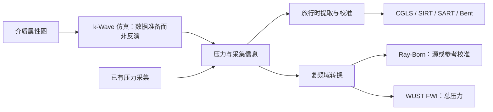

# usct-benchlab

[English](README.md) · [使用指南](docs/usage.md) · [算法说明](docs/algorithms.md) · [Agent API](docs/agent_algorithm_api.md)

面向科研的**二维超声声速重建算法库**，提供统一数据/结果接口、原生物理算子、数值求解器及独立 WUST 全波反演运行时接入。活跃重建范围为 sound-speed-only；数值与仿体验证不代表临床有效性认证。

## 当前 Main 的主要更新

- **原生 Bent/Eikonal**：使用非线性 fast-marching 旅行时及离散 Jacobian/伴随，替代此前复用直线投影的 surrogate。
- **原生 Ray-Born**：支持固定背景与重新线性化的 WKB / Full-Green 压力反演。命令 id 暂保留 `rwave_adapter`，不声称完整复现上游 r-Wave 软件。
- **保留压力的 k-Wave 数据入口**：明确几何、轴、Fourier 约定、有效掩码及来源；旅行时特征与复压力不再混为同一种观测。
- **生产 FWI 统一为 `fwi_wust`**：由维护中的 WUST fork 负责频域输入和 MATLAB/CUDA 重建，旧 FWI 执行链及结果导入 API 已移除。
- **参数与执行契约**：统一 typed 参数定义，区分 Agent/专家/部署权限，记录预算、停止原因，并支持无 GT 时可用的评价。

公开算法为下表中的六项，不提供衰减重建入口。`TinyFWIAlgorithm` 只保留为可直接 import 的数学回归测试工具，不属于 CLI/Agent 算法。

## USCT 与数学模型

USCT 是一个 **PDE 约束的反问题**：发射器激发声场，接收器记录压力，反演估计声速场 $c(x)$。简化的常密度、无耗散模型为：

$$
\frac{1}{c(x)^2}\partial_{tt}p_s(t,x)-\Delta p_s(t,x)=q_s(t,x),\qquad d_{sr}(t)=\mathcal M_r p_s(t,\cdot)+\eta_{sr}(t).
$$

| 模型 | 数学关系 | 含义 |
|---|---|---|
| 直线传播 | $A\delta s\approx\Delta t$，$\delta s=1/c-1/c_0$ | 固定路径；CGLS/SIRT/SART 使用不同更新方法 |
| Eikonal | $\lVert\nabla T_s\rVert=1/c$ | 随当前介质变化的首到旅行时 |
| Born | $\delta\hat p\approx J_m\delta m$，$m=1/c^2$ | 背景场附近的复压力灵敏度 |
| FWI | 由 Helmholtz 方程求 $\hat p(c)$ | 非线性总压力反演 |

代表性的直线反演目标是：

$$
\min_{\delta s}\frac12\lVert W(A\delta s-\Delta t)\rVert_2^2+\frac{\lambda^2}{2}\lVert L\delta s\rVert_2^2.
$$

这描述二次 CGLS，不意味着所有代数更新方法求同一个目标：SIRT 带有行归一化，subset SART 也不保证全局损失单调下降。WUST 使用总复压力，并消除每个发射器/频率的复源尺度。详见[数学说明](docs/math_formulation.md)。

## 支持的算法

| 方法 | 命令 id | 观测要求 | 配置 |
|---|---|---|---|
| CGLS | `straight_cgls` | 旅行时差、有效性/权重 | [cgls.yaml](configs/algorithms/cgls.yaml) |
| SIRT | `straight_sirt` | 旅行时差、有效性/权重 | [sirt.yaml](configs/algorithms/sirt.yaml) |
| SART | `straight_sart` | 旅行时差、有效性/权重 | [sart.yaml](configs/algorithms/sart.yaml) |
| Bent / Eikonal | `bent_ray_gn` | 首到时或校准后的时延 | [bent_ray.yaml](configs/algorithms/bent_ray.yaml) |
| Ray-Born / Full-Green | `rwave_adapter` | 复压力及源校准或独立水参考 | [rwave.yaml](configs/algorithms/rwave.yaml) |
| WUST FWI | `fwi_wust` | 总复压力、明确约定和掩码 | [fwi_wust.yaml](configs/algorithms/fwi_wust.yaml) |

Born 变体为 `wkb_fixed`、`wkb_nonlinear`、`full_green_fixed`、`full_green_nonlinear`。提供的 YAML 选择 nonlinear Full-Green；应查询具体变体，不能假设各入口默认相同。WKB 灵敏度是其非线性预测导数的近似；Eikonal 的离散导数依赖当前传播 stencil，分支切换处可能不光滑。

规范算子入口是 `usctbench.operators.straight_ray`、`.eikonal`、`.ray_born`。前向预测、线性化和伴随分别负责不同计算，**伴随不是逆算子**。旧 `operators.forward.*` / `operators.adjoint.*` 仅作兼容导入。

## 安装与快速运行

在本仓库 checkout 中执行：

```bash
conda create -n usctbench python=3.10 -y
conda activate usctbench
pip install -e ".[dev,viz]"
usct --help
usct list-algorithms --json
bash examples/synthetic_quickstart.sh
```

quickstart 写入 `/tmp/usctbench_examples`，不需要 MATLAB/GPU。也可先 `pip install -r requirements.txt`，再 `pip install -e ".[viz]"`。可选 `.[performance]` 启用原生循环的编译加速。

## 环境与数据准备

```text
workspace/
  code/          # 本仓库：src/、configs/、tests/、docs/、scripts/
  data/          # 属性图与转换后的 USCTCase
  runs/          # 重建、日志和报告
  external/      # 维护中的 WUST checkout
  checkpoints/   # 本地文件，不提交 Git
```

```bash
export USCT_WORKSPACE=/path/to/workspace
export USCT_DATA_ROOT="$USCT_WORKSPACE/data/openbreastus"
export USCT_NBP_ZIP_PATH=/path/to/NBPslices2D.zip
export USCT_RUN_ROOT="$USCT_WORKSPACE/runs"
mkdir -p "$USCT_RUN_ROOT"
```

### 简化 ToF Demo

下面生成的是由属性图投影得到的直线模型观测，**不是 k-Wave 压力**：

```bash
usct data make-synthetic-smoke --out "$USCT_WORKSPACE/data/synthetic_demo" --shape 48 --n-transducers 48

usct data inspect-openbreastus --root "$USCT_DATA_ROOT" --out "$USCT_RUN_ROOT/openbreastus_index.json"
usct data make-quality --root "$USCT_DATA_ROOT" --out "$USCT_WORKSPACE/data/openbreastus_demo" --cases-per-density 1 --converted-shape 256 --n-transducers 128

usct data inspect-nbpslice2d --zip "$USCT_NBP_ZIP_PATH" --out "$USCT_RUN_ROOT/nbpslice2d_index.json"
usct data make-nbp-quality --zip "$USCT_NBP_ZIP_PATH" --out "$USCT_WORKSPACE/data/nbpslice2d_demo" --cases-per-type 1 --converted-shape 256 --n-transducers 128
```

匹配模型的 Eikonal/Born 验证使用各自模型生成的观测。NBPslice2D 的属性图不等于内置波场；OpenBreastUS 的属性图和预计算波场也要区分。详见[数据集说明](docs/datasets.md)。

### k-Wave / 已有压力数据



统一采集来源不等于统一观测量。各方法仍需匹配的特征/校准流程，ToF-only case 不能直接用于压力反演。生产 FWI 不从 GT 重新生成观测。

对受支持的 WUST 布局 MATLAB v7.3 数据，可以使用：

```bash
python -m usctbench.data.waveforms /path/to/acquisition.mat /path/to/pressure_case.h5 \
  --frequencies-hz 150000 200000 250000 --reference-sound-speed-mps 1500
```

频率仅为语法示例，不是推荐频段。这不是任意 MAT 转换器，也不会自动补全所有算法的 ToF 特征；Born 还需检查水参考/源校准。见[压力导入实现](src/usctbench/data/waveforms.py)及[物理验证](docs/physics_validation.md)。

| 内容 | 约定 |
|---|---|
| 图像 / 几何 | `[y,x]`；声速 m/s、坐标 m、像素边缘 origin |
| 压力 | `time_data[time,tx,rx]`、`freq_data[frequency,tx,rx]` |
| 采样 | 实际时间 s、频率 Hz，明确 Fourier/归一化约定 |
| 有效性 | 显式掩码；有效零信号不是缺失值 |

## 运行算法与 Benchmark

```bash
usct run straight_cgls \
  --case "$USCT_WORKSPACE/data/synthetic_demo/cases/synthetic_circular_sos.h5" \
  --config configs/algorithms/cgls.yaml --out "$USCT_RUN_ROOT/single_cgls"

usct run bent_ray_gn --case /path/to/tof_case.h5 --config configs/algorithms/bent_ray.yaml --out "$USCT_RUN_ROOT/single_bent"
usct run rwave_adapter --case /path/to/pressure_case.h5 --config configs/algorithms/rwave.yaml --out "$USCT_RUN_ROOT/single_born"
```

SIRT/SART 对 ToF case 使用 `straight_sirt` / `sirt.yaml`、`straight_sart` / `sart.yaml`。更多命令见[使用指南](docs/usage.md)。

```bash
export USCT_SYNTHETIC_CASE_GLOB="$USCT_WORKSPACE/data/synthetic_demo/cases/*.h5"
export USCT_OPENBREASTUS_CASE_GLOB="$USCT_WORKSPACE/data/openbreastus_demo/cases/*.h5"
export USCT_NBP_CASE_GLOB="$USCT_WORKSPACE/data/nbpslice2d_demo/cases/*.h5"
usct bench --suite configs/benchmarks/synthetic_demo.yaml
usct bench --suite configs/benchmarks/openbreastus_demo.yaml
usct bench --suite configs/benchmarks/nbpslice2d_demo.yaml

# 该套件同时运行射线方法，准备好的压力 case 还需要包含 ToF。
export USCT_PRESSURE_CASE_GLOB='/path/to/pressure_cases/*.h5'
usct bench --suite configs/benchmarks/physics_pressure.yaml
```

ToF demo 套件中 Bent 属于跨模型 smoke，不是匹配 Eikonal 的数值验证。ToF 与压力残差保留各自观测域，不按残差原始数值大小混排。

## WUST FWI

生产路线为 **`fwi_wust → 维护中的 WUST runtime → MATLAB/CUDA`**。使用 [lucian-dw/WaveformInversionUST](https://github.com/lucian-dw/WaveformInversionUST) 的批准版本 `79e347015be64cca88bacf591b4eed0952398800`（runtime `0.2.0-dev.1`，schema 1）。未经适配的上游 checkout 不能直接替代；WUST 保持独立，不反向依赖 BenchLab。

```bash
export USCT_WUST_ROOT=/path/to/approved/WaveformInversionUST
python "$USCT_WUST_ROOT/Runtime/python/wust_runtime.py" describe --json
usct describe-algorithm fwi_wust --json
usct run fwi_wust --case /path/to/frequency_case.h5 \
  --config configs/algorithms/fwi_wust.yaml --out "$USCT_RUN_ROOT/single_fwi"
export USCT_WUST_CASE_GLOB='/path/to/frequency_cases/*.h5'
usct bench --suite configs/benchmarks/fwi_wust_demo.yaml
```

在部署机器构建并验证 CUDA MEX。CPU 仅作 reference/debug，不自动回退为生产后端。配置并非经过校准的预设，运行前需确认声速范围、PML 与初始化。

- 输入为已有**总复压力**、mask 和 `pressure_contract`；排序、几何 snapping、索引及压力规范化由 WUST 负责。
- WUST 按 TX/频率消除复源尺度，不要求将 Born 源校准当作其必需输入。
- 一个频率条目对应一次更新；`max_iterations` 截断 schedule，整个运行需要硬时间预算。
- 不接受 forward/adjoint 调用上限或非空 `update_rtol`；schedule 完成不等于收敛。
- 每步 loss 是更新前诊断，缺少的最终模型残差保持 null。

旧 `fwi_kwave_adapter`、diffusion adapter、任意 pipeline 模块/参数和旧 MAT 结果导入约定不再是生产 API。详见[FWI 部署与契约](docs/fwi.md)。

## 参数说明与 Agent 接入

Python、YAML、CLI 使用同一套 typed 定义；未知字段与冲突别名显式拒绝。见[参数契约](docs/parameter_contract.md)和 [Agent API](docs/agent_algorithm_api.md)。

| 分类 | 典型设置 | 负责方 |
|---|---|---|
| `agent` | 批准的变体、声速范围、正则化形式、部分初始化/更新选择 | Agent 经验证后提交 |
| `advanced` | 正则化强度、内层求解与精度、平滑、线搜索、ROI/图像、专家停止策略 | 研究者 / 受信任策略 |
| `internal` | 测量参考与采集事实、运行时路径、MATLAB/GPU 后端、缓存/临时目录 | 部署与数据工具 |

默认 Agent 可提交的具体算法字段如下，计算预算另行传递：

| 方法 | 允许的算法参数 |
|---|---|
| CGLS | `sound_speed_bounds_mps`、`regularization`、`robust_loss` |
| SIRT / SART | `sound_speed_bounds_mps`、`relaxation` |
| Bent | `sound_speed_bounds_mps`、`initialization`、`regularization` |
| nonlinear Born | `sound_speed_bounds_mps`、`mode`、`green_backend`、`initialization`、`regularization`、`regularization_length_wavelengths`、`max_update_mps` |
| fixed Born | 同类物理 selector 和正则化字段，但没有 `initialization`、`max_update_mps` |
| WUST | `initialization`（reference/scalar）、`initial_sound_speed_mps`、`sound_speed_bounds_mps`、`frequency_schedule_hz`、`max_update_mps` |

`regularization_lambda` 属于 **advanced**，不是 Agent 可随意调的系数。selector 不得与选定 variant 冲突，也没有未经实验校准的 weak/strong 或 quick/thorough 预设。

```bash
usct list-algorithms --json
usct describe-algorithm rwave_adapter --variant full_green_nonlinear --json
usct describe-algorithm straight_cgls --json --case /path/to/case.h5
```

JSON 提供输入要求、schema/defaults、运行依赖和迭代单位；case 可用频率/校准与静态能力分开。自主执行应使用 `make_agent_config` admission；任意 `--config` YAML 属于专家入口，不是安全边界。部署方 `trusted_parameters` 不得来自模型输出。

## 停止与评价

`RunControls` 将计算请求与算法参数分开，`BudgetCaps` 只能收紧预算。默认 Agent 提交预算而非任意收敛阈值；新入口**没有默认 `update_rtol`**。旧专家策略可能不同，实际采用的 resolved policy 会保存。

| 结果类型 | 原因例子 | 含义 |
|---|---|---|
| 驻点 / 目标满足 | `stationary_gradient`、`target_residual` | 满足某项数值条件，不等于图像真实或全局最优 |
| 停滞 | `small_model_update`、`objective_plateau` | 变化小，不能单独证明最优性 |
| 预算 / 完成 | `max_iterations`、`time_budget`、WUST schedule 完成 | 工作停止/完成，不等于收敛 |
| 失败 | `numerical_failure`、`line_search_failed`、输入/运行时错误 | 保留原因与日志，不伪装为成功重建 |

相对更新按声明变量计算：直线/Eikonal 用完整慢度，Born 用平方慢度，WUST 用 mask 内慢度作诊断。SART 一轮、GN 外迭代和 FWI 频率更新的成本不同。详见[评价和停止](docs/agent_evaluation.md)。

有 GT 时报告组织区 RMSE/PSNR/SSIM，并保留全图及水背景指标；GT mask 仅用于事后评价。无 GT 时图像指标不可用，不填零；使用能够取得的模型一致性残差。留出评估是可选协议，用于选模的 validation 不是独立 test。

## 重建表现

**默认配置是运行示例，不是以下主图的复现实验配置。** 保存的实验采用不同预算、初始化、停止策略及评价输入。有实验数据包时可以重绘这些结果，但不能承诺当前 main 的默认 YAML 会重新反演出历史图像。见[默认配置与主图实验的差异](docs/readme_results.md#default-configs-are-not-the-figure-recipe)。

以下四图替换此前混合 surrogate 的示例，来自保存的八样本实验，**不是在当前 HEAD 重跑全部算法**。每行包含 GT 及保存的高频 **FWI reference**，后者不是新 `fwi_wust` API 的运行证据。每行使用一致的组织区 PSNR/SSIM 规则与评价坐标，每个数据集共享灰度范围。

### 匹配模型验证

直线方法使用 straight-ray ToF；原生 Bent 使用 Eikonal ToF；fixed Born 使用匹配压力数据。FWI 列仍为单独的 k-Wave 参考，不能将这些不同输入按统一采集排名。


### k-Wave 采集示例

五种原生方法来自共同重生成的 object/water 采集（128 TX/RX），分别使用 ToF 或复压力。历史 FWI 的采集历史、频率安排与留出策略不同。图中保留实际伪影及预算/停滞下的结果，不能据此认定公平排名或算法的成像质量上限。


[来源与重绘说明](docs/readme_results.md) · [指标与停止原因](docs/assets/reconstruction/metrics.csv) · [哈希和评价策略](docs/assets/reconstruction/manifest.json)。

## 输出文件

```text
runs/single_cgls/synthetic_circular_sos/
  result.h5       # 重建结果
  metrics.json    # 可用的图像/数据指标
  metadata.yaml   # 配置、来源、状态与执行记录
  preview.png     # 预览图

runs/<benchmark_run_id>/
  <algorithm>/<case_id>/...
  benchmark_summary.csv
  benchmark_report.md
```

除图像外应检查停止/失败记录；WUST 的交换文件与日志留在 run 目录，不进入 Git。

## 常见问题与开发

- 找不到算法：检查 discovery，旧 FWI 和 Tiny id 不再是公开算法。
- 没有匹配 case：检查带引号的 `USCT_*_CASE_GLOB` 与转换文件。
- 压力输入被拒绝：检查观测域、校准、轴、mask 和 Fourier 声明，不把 ToF 改标签冒充压力。
- FWI 不可用：验证固定版本 WUST、MATLAB/CUDA/MEX，不静默改用 CPU。
- NaN/Inf 或线搜索失败：先检查单位与数值诊断，再决定是否调整配置。
- 缺少绘图依赖：安装 `.[viz]`。

```bash
black --check src tests scripts
ruff check src tests scripts
python -m compileall -q src tests
pytest -q
bash scripts/run_smoke.sh
python scripts/audit_release.py
```

普通 CI 使用无硬件依赖的运行时协议测试。真实 MATLAB CPU 集成与 GPU 部署验证是独立验收环节。见[开发说明](docs/development.md)。

## 引用与许可证

请引用实际使用的数据和方法：OpenBreastUS、NBPslice2D、k-Wave、Eikonal/Ray-Born 研究及 WaveformInversionUST。见 [references.bib](docs/references.bib)、[算法说明](docs/algorithms.md)及运行时自身的来源声明。BenchLab 使用 [MIT License](LICENSE)，外部依赖保留各自许可证。
