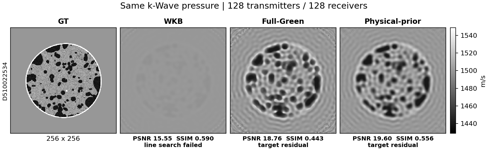
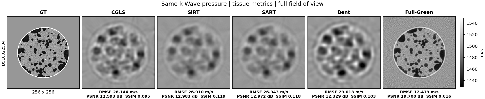

# Breast-pressure physics validation: 2026-09-08

This is a development evidence record on `work/physics-agent-validation`, not
a benchmark ranking or a claim of clinical validation. Inputs are independently
generated k-Wave object/water pressures from breast property maps. GT is used
only for forward-model diagnostics and post-hoc image metrics, never for source
fitting, initialization, inversion masks, line search or stopping.

## What changed

- Native fast-marching Eikonal propagation and its discrete tangent/adjoint are
  retained. Optional compiled loops execute the same scheme. Bent-ray now
  smooths the proposed update once, rather than repeatedly smoothing the entire
  image during line search; a training-only CGLS warm start is optional.
- Born inversion rebuilds the current background and checks the actual nonlinear
  pressure objective. The new full Green backend solves the free-space volume
  integral equation using linear FFT convolution and GMRES. The field-product
  Born Jacobian matches this discrete nonlinear model to linear-solve accuracy.
  This is distorted Born, **not** a complete upstream geometrical r-Wave port.
- Optional regularization uses a physical length derived from the training
  wavelength. Optional phase-CGLS initialization uses at least three training
  frequencies and an independently acquired water reference.
- Run outputs retain online stopping history, selected iteration, work counts,
  receiver/frequency validation, resolved parameters and source hashes. The
  validation launcher now freezes a private source snapshot before each run.
- Pressure conversion reads bounded time slabs instead of decompressing the same
  MATLAB channel plane for every receiver. It preserves time origin, complex
  source spectrum, water pressure and explicit axis/Fourier conventions.

## Acquisition and evaluation

The low-band collection contains four NBP cases (`A540024479`, `B530113966`,
`C520105117`, `D510022534`) and four OpenBreastUS cases (class 1/000000,
2/001800, 3/003600, 4/005400). Each uses 128 transmitters and 128 receivers,
a 256 x 256 inverse grid and a three-cycle 200 kHz source. Simulation grids
are selected for at least eight points per wavelength and PML clearance:
NBP A/B/C use 512 x 512, NBP D uses 256 x 256, OpenBreastUS uses 1024 x 1024.
These are 2-D, constant-density, attenuation-free simulations, not clinical RF.

The initial pressure training frequencies are 150/200 kHz, with 250 kHz held
out. The phase-initialized pilot extracts 100/150/200/250 kHz from the **same raw
traces** and trains on the first three. Thus initialization and adding a low
training frequency change together; this is not an isolated initialization
ablation. Receiver validation uses fraction 0.125, seed 42, and excludes the
reciprocal training channel too. Validation controls stopping and checkpoint
selection; it is **not an untouched final test set**.

Straight/Eikonal methods use bounded normalized water-relative pulse delays from
these same traces. A pulse/group delay is not exactly an Eikonal first arrival.
Pressure methods do not reuse broadband ToF confidence for frequency holdout.
No GT tissue support is supplied to the solvers. `roi_update_only: true` alone
does not construct a mask.

QC passes the implemented CFL/PPW/finiteness/channel-coverage gate; that gate does
not certify all boundary, attenuation, dimensionality or experimental mismatch.
The early eight-case ray run overlapped development of the Bent smoothing fix.
It is retained as exploratory evidence, not a frozen, fair eight-case ranking.
Earlier 48 x 48 / 16-element plots in `assets/` are coarse diagnostic records;
their imaging performance must not be presented as high-resolution acceptance.

## Background physics: independently simulated pressure

Relative residual below compares predicted pressure with k-Wave object pressure.
For the GT diagnostic only, the model is set to the GT map. Source calibration
uses the separate water acquisition. No reconstruction parameters are fitted to
these GT diagnostic numbers.

| Case / model | Relative pressure residual |
| --- | ---: |
| NBP D: homogeneous water model | 0.267961 |
| NBP D: original WKB at GT | 0.434118 |
| NBP D: conservative-flux WKB at GT | 2.004552 |
| NBP D: full Green at GT | **0.004033** |
| OpenBreastUS class 1: homogeneous water model | 1.101633 |
| OpenBreastUS class 1: full Green at GT | **0.012878** |

The conservative WKB transport passes a manufactured radial-flux refinement
test but worsens the breast-pressure background. It is not a successful imaging
fix. A frozen Born adjoint alone does not establish that it differentiates WKB.
The full Green directional-derivative relative errors are 8.88e-8 (NBP D) and
3.91e-7 (OpenBreastUS class 1). Independent water/source-fit relative residuals
are 2.05e-5 and 6.22e-5 respectively. These tests locate the old background
problem without asserting that optimization from water is solved.

## Low-band reconstruction pilot

Full-image PSNR uses the finite GT range; SSIM uses complete valid 7-pixel
windows. No images are individually contrast-stretched, rotated or sharpened.
The physical-length trial uses lambda 0.2 with length = c0/(2*pi*f_max_train),
relative training-Jacobian scaling, and recomputed-pressure line search.

| NBP D | RMSE (m/s) | PSNR (dB) | SSIM | Training residual | Stop |
| --- | ---: | ---: | ---: | ---: | --- |
| CGLS | 21.167 | 15.068 | 0.499 | 0.02037 | 120 iterations |
| SIRT | 20.399 | 15.389 | 0.529 | 0.06306 | 200 iterations |
| Bent | 22.522 | 14.529 | 0.445 | 0.07296 | 300 s budget |
| Conservative WKB | 20.025 | 15.549 | 0.590 | 0.23226 | line-search failure |
| Full Green | 13.838 | 18.760 | 0.443 | 0.00514 | target residual |
| Full Green + physical length | 12.555 | 19.605 | 0.556 | 0.00617 | target residual |
| Full Green + physical length + phase seed / 100 kHz | **12.362** | **19.739** | 0.579 | 0.01065 | 600 s budget |

ToF and pressure residuals measure different observables and are not directly
rankable. The full Green physical-length trial reduces held-out frequency
residual from 0.04043 to 0.03317 and post-hoc water-region RMSE from 5.823 to
4.200 m/s. The phase-seeded trial has held-out receiver residual 0.01047 and
frequency residual 0.03405. These are validation, not test metrics.



The nearly uniform WKB result has deceptively high full-image SSIM because water
occupies much of the image. The added CSV reports tissue-only metrics with an
explicit **post-hoc GT mask**, and high-pass correlation (Gaussian sigma 2 px).
The mask is the hole-filled non-water support, with water defined by
abs(GT - 1500) <= 0.1 m/s; it is never fed back to inversion. These are diagnostic
texture metrics, not a new parameter-selection criterion.

For OpenBreastUS class 1, a 600 s full Green cold start gives RMSE 49.503,
PSNR 7.799, SSIM -0.020. The phase-seeded / added-100-kHz trial gives RMSE
16.559, PSNR 17.311 and full-image SSIM 0.245. Tissue SSIM is 0.401 and high-pass
correlation 0.505, but substantial background artifacts remain. Only two updates
finish in its budget, and the training residual is still 0.211. This is an
optimization/local-minimum and runtime limitation despite the accurate GT
forward prediction, not a claim of FWI-quality reconstruction.


## Why more iterations did not strengthen the ray images

A bounded predeclared probe used CGLS lambda 0.005 with coverage preconditioning,
SIRT smoothing 0.2 px every five updates, SART 0.25 px every five sweeps, and
larger iteration caps. It disabled the residual target but kept validation,
stagnation and a 600 s budget. Lower residual did not imply more true texture:

| NBP D | RMSE | PSNR | SSIM | Training ToF residual |
| --- | ---: | ---: | ---: | ---: |
| Lower-penalty CGLS | 21.254 | 15.032 | 0.476 | 0.01062 |
| Lower-smoothing SIRT | 20.289 | 15.436 | 0.322 | 0.00086 |
| Lower-smoothing SART | 20.318 | 15.424 | 0.320 | 0.00062 |
| Bent with CGLS seed and update smoothing | 23.120 | 14.302 | 0.354 | 0.06165 |

These settings are not promoted to quality defaults. An initial Bent probe had
a projector-constructor error; its failed artifact was preserved, the call was
fixed and tested, and a fresh stage was run. That implementation failure is not
counted as an algorithm convergence result.

Post-hoc forward evaluation at GT gives NBP D pulse-delay relative errors 0.609
(straight) and 0.570 (Eikonal), or 0.123/0.115 microseconds RMSE. Corresponding
OpenBreastUS values are 0.278/0.296, or 0.460/0.489 microseconds. Thus driving a
ray residual to zero can fit feature/model error. First-order marching error,
finite-frequency diffraction and multipath remain distinct from optimizer
quality. More output pixels cannot restore information discarded by the feature.

## Bandwidth control and remaining acceptance

Inspection of the historical NBP B production FWI result's `FREQ_ITER` gives
300 to 800 kHz in 25 kHz increments, each repeated three times (63 iterations).
It is not fair to attribute the difference from 150/200 kHz Born images solely
to algorithms. A separate NBP D pilot generates a three-cycle 500 kHz source,
300/500/700/800 kHz pressure features and a 1024 x 1024 simulation grid. Inversion
remains 256 x 256 / 128 x 128 channels. Results of that bandwidth ablation are
recorded below; no old input file is overwritten.

### Completed high-band NBP D pilot

The new simulation completed with PML 20, CFL 0.2, minimum PPW 14.32 and no
NaN/Inf. Object and water are independent k-Wave simulations. Pressure fitting
uses 300/500/700 kHz for training and holds out 800 kHz. This is **one NBP D
case**, not a completed high-band eight-case benchmark. Native inversion is CPU
work on the A100 host; the k-Wave simulation uses the GPU.

Full Green now recovers visible internal inclusions. Its tissue RMSE is
**12.419 m/s**, PSNR **19.700 dB**, SSIM **0.616**, and high-pass correlation
**0.734**. Training pressure relative residual is 0.05360, receiver validation
0.06857 and frequency validation 0.11167. Three accepted updates fit within the
600 s cooperative budget (600.66 s recorded). The same method's full-image SSIM
is only 0.521 because exterior water contains artifacts; its exterior-water
RMSE is 5.162 m/s. Water error is not removed or corrected in the reconstruction.

The phase-seeded low-band result had tissue RMSE 18.912, PSNR 16.046 and SSIM
0.347. The new acquisition therefore supports stronger visible texture, but
this is a bandwidth/acquisition change as well as an inversion run. It is not
evidence of a purely optimizer-driven gain or equality with production FWI.

### Primary scores now exclude exterior water

New CLI/benchmark runs use the evaluation-only policy
`tissue_external_water_v1`: exclude four-connected boundary water within
0.1 m/s of 1500 m/s, retaining enclosed water-speed tissue. No GT mask enters
the solver. RMSE uses this region; PSNR and SSIM use the common full-GT range.
SSIM averages windows completely inside tissue. Full-image scores and exterior
water RMSE/bias remain separate. Historical result files and figures above keep
their original definitions; the new report re-evaluates their final arrays
without rerunning or modifying them.

This corrects a misleading comparison: envelope SIRT has full-image SSIM 0.545,
higher than Full Green's 0.521, but its **tissue SSIM is only 0.119 versus 0.616**.
The mask is identical across algorithms (SHA-256
`6baa5942c93afba21b1cd3a424b8909225fca66c786ab4587f0bdd2274553ccb`).
See [evaluation policy](../agent_evaluation.md) for missing-GT behavior and
the explicit distinction between reporting and inversion masks.

### Ray feature and regularization probes

An alternate Hilbert-envelope onset uses threshold 0.1 of the direct-window
peak and minimum peak/noise ratio 5, relative to the separate water trace.
Source, raw pressure, frequency pressure, water reference, frequencies, geometry
and GT are unchanged. The alternate HDF5 differs only in ToF/quality and feature
metadata. The used-pair fraction is 0.6693 instead of 0.6681 for xcorr; this small
mask/weight difference is part of the feature-path change, not an isolated
picker-only ablation. Frequency-pressure arrays and geometry were checked for
exact equality between both extracted cases.

| Ray feature / solver | Tissue RMSE (m/s) | PSNR (dB) | SSIM |
| --- | ---: | ---: | ---: |
| Bounded xcorr / CGLS | 30.071 | 12.018 | 0.080 |
| Envelope / CGLS | 28.146 | 12.593 | 0.095 |
| Bounded xcorr / SIRT | 28.908 | 12.361 | 0.105 |
| Envelope / SIRT | 26.910 | 12.983 | 0.119 |
| Bounded xcorr / SART | 28.996 | 12.334 | 0.102 |
| Envelope / SART | 26.943 | 12.972 | 0.118 |
| Bounded xcorr / Bent | 31.786 | 11.537 | 0.060 |
| Envelope / Bent | 29.013 | 12.329 | 0.103 |

All four envelope baselines below share the same ToF values, valid rays,
confidence and receiver split. Full Green uses complex pressure from that same
raw acquisition, rather than those derived ToFs. Both paths keep the full
256 x 256 reconstruction field. The image captions are **tissue** metrics.



[Per-method tissue/full-image/holdout scores](assets/high_band_tissue_metrics.csv),
[exact evaluation policy](assets/high_band_evaluation_policy.json), and
[evaluation mask](assets/high_band_evaluation_mask.png) accompany this figure.
The respective selected/completed iterations are CGLS 120, SIRT 200, SART 100,
Bent 20 and Full Green 3. Each has a 600 s cap plus its declared iteration cap,
validation and stagnation stops; this is not an equal-work algorithm ranking.

The envelope path modestly improves these ray results, but still blurs internal
structure. At GT, straight-ray ToF RMSE falls from 0.09697 to 0.08678 us and
correlation rises from 0.8194 to 0.8636. Eikonal ToF RMSE changes from 0.09662
to 0.08818 us. These are **post-hoc model checks**, not inputs or GT-tuned
corrections. High envelope SNR does not certify unbiased arrival times.

On that same envelope case, a lower-penalty/lower-smoothing probe and a separate
Huber probe give:

| Change | Tissue RMSE | PSNR | SSIM | Training ToF relative residual | Stop |
| --- | ---: | ---: | ---: | ---: | --- |
| CGLS lambda 0.005 + coverage preconditioning | 28.842 | 12.381 | 0.085 | 0.03069 | validation plateau |
| SIRT sigma 0.2 every five updates | 28.445 | 12.501 | 0.072 | 0.00132 | small update |
| SART sigma 0.25 every five sweeps | 28.254 | 12.559 | 0.077 | 0.00090 | small update |
| Bent + CGLS seed, lambda 0.005, update sigma 0.3 | 38.887 | 9.785 | -0.006 | 0.14944 | 20 outer iterations |
| CGLS Huber delta 0.1 us, three IRLS stages, otherwise baseline | 28.105 | 12.605 | 0.096 | 0.07393 | 120 iterations |

The first four settings are **not** promoted. Huber gives only a marginal change,
not a texture-quality breakthrough. The evidence does not support treating a
few extreme rays or insufficient iteration count as the sole cause. Further ray
work should separate finite-frequency feature/model error and marching-grid
error before stronger fitting or cosmetic sharpening. No GT-derived support,
post-hoc deblurring, or background-bias subtraction was applied.

These are development-case probes. Inspecting their GT image scores means this
case cannot be presented as an untouched imaging test. No new quality default is
selected simply by its best GT score; a frozen protocol on separate cases is
still needed.

The current evidence does **not** establish strong imaging for every ray method,
full upstream r-Wave parity, all-eight-case Born acceptance, or equivalence to
production FWI. A final FWI comparison must run on the same new acquisition with
documented noise, bandwidth, calibration, validation and resource policies.
The larger OpenBreastUS FOV also needs a finer inverse grid before an 800 kHz
Born run; increasing only the simulator resolution is insufficient.

## Reproduce and inspect

Set `RUN_ROOT` to an output directory, `PROPERTY_CASE` to a supported property-map
HDF5 and `KWAVE_PATH` to the external k-Wave installation. All generated pressure,
source snapshots and reconstruction arrays stay outside the repository.

```bash
pip install -e ".[dev,viz,performance]"
python scripts/validate_physics.py batch \
  --cases "$PROPERTY_CASE" --out "$RUN_ROOT/high_band_800" \
  --workers 1 --device 2 --transducers 128 --image-size 256 \
  --source-frequency 500000 --max-frequency 800000 \
  --frequencies 300000 500000 700000 800000 --kwave-path "$KWAVE_PATH"
python scripts/validate_physics.py reconstruct \
  --out "$RUN_ROOT/high_band_800" --run-name native_ray \
  --algorithms straight_cgls straight_sirt straight_sart bent_ray_gn \
  --workers 1 --seconds 600
python scripts/validate_physics.py reconstruct \
  --out "$RUN_ROOT/high_band_800" --run-name full_green_phase \
  --algorithms rwave_adapter --rwave-initialization phase_cgls \
  --rwave-length-wavelengths 0.15915494309189535 --workers 1 --seconds 600
python scripts/check_ray_born_background.py \
  --case "$RUN_ROOT/high_band_800/D510022534/pressure_case.h5" \
  --out "$RUN_ROOT/high_band_800/D510022534/background_check" \
  --green-backend volume_integral --ray-tof
python scripts/validate_physics.py extract \
  --out "$RUN_ROOT/high_band_800/D510022534" --image-size 256 \
  --frequencies 300000 500000 700000 800000 \
  --tof-method envelope --envelope-fraction 0.1 --case-file envelope_case.h5
python scripts/validate_physics.py reconstruct \
  --out "$RUN_ROOT/high_band_800" --case-file envelope_case.h5 \
  --run-name envelope_all_rays \
  --algorithms straight_cgls straight_sirt straight_sart bent_ray_gn \
  --workers 1 --seconds 600
python scripts/validate_physics.py reconstruct \
  --out "$RUN_ROOT/high_band_800" --case-file envelope_case.h5 \
  --run-name envelope_huber_probe --algorithms straight_cgls \
  --cgls-huber-delta-us 0.1 --workers 1 --seconds 600
```

The executed envelope baselines were split between stages `envelope_ray`
(CGLS/SIRT) and `envelope_ray_complement` (SART/Bent), with the same resolved
settings as the combined command above. `--detail-probe` selects the explicitly
reported lower-smoothing settings, not a recommended default. Use fresh output
names: existing cases/runs are intentionally not overwritten.

Numerical gates cover water/heterogeneous forward errors, exact adjoints,
directional derivatives, nonlinear descent, units-invariant regularization,
held-out-frequency mutation, truth-free stopping, failure handling and HDF5
round trips. Actual A100 MATLAB tests exercise the installed external WUST
matrix/derivative bridge (two external integration tests and one isolated
Jacobian test passed); they do not certify its full
production optimizer trajectory. Full local suite at this checkpoint: 144
passed before the tissue-metric extension. After that extension, local and A100
suites both pass 161 tests with two optional external-MATLAB tests skipped.
The synthetic smoke contains an all-water case with no tissue; its gate now
explicitly uses `full_image_rmse`/`full_image_ssim`, not fabricated tissue scores.
The complete local smoke and release audit pass. These tests validate contracts
and numerical implementation, not strong image quality for every algorithm.
